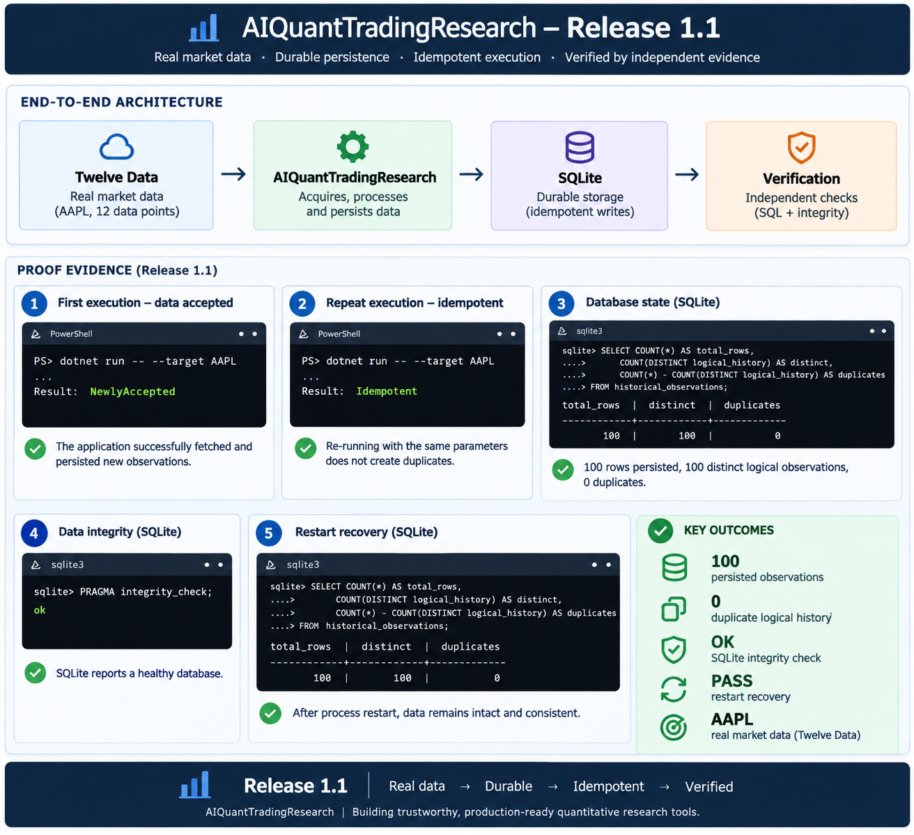

# AIQuantTradingResearch

> **A production-oriented quantitative research platform for acquiring and persisting real-world market data, built with C# .NET and an AI-assisted engineering workflow.**

[](https://github.com/samuel-santos-engineer/AIQuantTradingResearch/milestones)
[](https://github.com/samuel-santos-engineer/AIQuantTradingResearch/tree/main/tests)
[](https://github.com/samuel-santos-engineer/AIQuantTradingResearch/tree/main/tests/AIQuantTradingResearch.Architecture.Tests)
[			](https://dotnet.microsoft.com/)
[](LICENSE)

AIQuantTradingResearch is an open-source engineering project for building a quantitative research platform from the ground up with explicit architecture, executable quality gates, incremental delivery, and transparent technical decisions.

	The project is intentionally broader than a collection of trading algorithms or ML experiments. It demonstrates how market-data capabilities can be designed as a maintainable software platform while creating a foundation for later quantitative analytics, AI/ML research, observability, resilience, and cloud-native operation.

**Current closed milestone:** **[Release 1.7: Durable Experiment Evidence Discover](https://github.com/samuel-santos-engineer/AIQuantTradingResearch/milestone/55)**

**Current accepted milestone:** **[Release 1.8: Python & AI Engineering Foundation](https://github.com/samuel-santos-engineer/AIQuantTradingResearch/milestone/56)** — closed with all 13 work packages complete.

[What Works Today](#what-works-today) · [Architecture](#architecture) · [Run &amp; Verify](#run--verify) · [Engineering Evidence](#engineering-evidence) · [Roadmap](#engineering-capability-journey) · [Engineering Handbook](#engineering-handbook)

---

## What Works Today

- **Acquisition & Persistence (v1.1):** High-fidelity Twelve Data ingestion to SQLite.
- **Dataset Snapshots (v1.2):** Bounded `[from, to)` datasets tied to deterministic SHA-256 identities.
- **Research Pipeline (v1.3):** Structured 5-stage orchestration from retrieval to registration.
- **Feature Generation (v1.4):** Pure mathematical extraction (`simple-return-lag-1-v1`) over immutable states.
- **Experiment Metrics (v1.5):** Descriptive aggregate computations (mean, min, max).
- **Durable Evidence (v1.6):** Schema v3 persistence mapping outcomes to `NewlyAccepted` or `IntegrityConflict` states.
- **Evidence Discovery (v1.7):** Mandatory bounded discovery (`MaximumResultCount`) returning ordered binary-sorted collections.
- **Python Engineering Foundation (v1.8):** Isolated CPython scientific-stack tooling and a tested local JSON-over-stdio integration boundary; Release 1.9 real-time visualization behavior has not begun.

### [Release 1.1: Market Data Persistence Foundation](https://github.com/samuel-santos-engineer/AIQuantTradingResearch/milestone/52)

Establish durable, provider-independent historical market-data persistence so normalized observations can be stored, reconstructed, retrieved, and reused deterministically while storage technology remains confined to Infrastructure.

Release 1.1 completes the first provider-backed, durable historical market-data vertical slice.

```text
Twelve Data
    │
    ▼
Infrastructure provider adapter
    │
    ▼
Application use cases
    │
    ├──────────────► Domain model
    │
    ▼
Infrastructure persistence adapter
    │
    ▼
SQLite
```

The current implementation can:

- Acquire historical market observations through the Twelve Data provider integration.
- Keep provider and storage details outside the Domain and Application layers.
- Persist historical observations durably in local SQLite storage.
- Retrieve historical observations deterministically in ascending chronological order.
- Preserve exact target, timestamp/offset, and decimal-value fidelity across persistence.
- Distinguish newly accepted, idempotent, and conflicting persistence outcomes.
- Preserve immutable accepted history and atomic write behavior.
- Map controlled storage failures through Application-owned failure contracts.
- Compose acquisition and persistence through an externally configured Worker execution root.
- Validate architectural boundaries with executable architecture tests.

### [Release 1.2: Research Dataset Foundation](https://github.com/samuel-santos-engineer/AIQuantTradingResearch/milestone/53)

Establish deterministic, versioned, reproducible, and discoverable research datasets with bounded metadata,
provenance, lineage, and catalog capabilities by reusing Release 1.1 durable historical observations.

Release 1.2 builds on Release 1.1 historical observations. It materializes one
exact-target, `[from,to)` research dataset definition into immutable SQLite
snapshot/catalog evidence. Definitions are ordered by semantic instant; empty
selection is valid; original offsets and decimal values are preserved. The
`aiq-dataset-identity-v1` scheme uses deterministic SHA-256-backed identities
for the definition, research dataset, source state, and snapshot; the snapshot
identity is also the immutable dataset version. Re-running equivalent evidence
is recognized without overwrite, while conflicts remain explicit.

Release 1.2 established the externally configured bounded dataset execution using
`Persistence:DatabasePath`, `Dataset:Target`, `Dataset:From`, and `Dataset:To`.
It remains the persistence foundation composed by Release 1.3.

### [Release 1.3: Research Pipeline Foundation](https://github.com/samuel-santos-engineer/AIQuantTradingResearch/milestone/54)

Deliver a deterministic fixed one-shot research pipeline by reusing persisted Release 1.1 historical observations
and Release 1.2 dataset materialization, snapshot, and catalog capabilities.

Release 1.3 composes persisted historical observations and the Release 1.2
dataset foundation into one fixed, deterministic, five-stage pipeline:
historical observation retrieval, dataset materialization, immutable snapshot
persistence, catalog registration, and structured result/evidence. Application
owns pipeline contracts, identities, orchestration, validation, and semantic
evidence; Infrastructure owns provider and SQLite mechanics; Worker remains the
outer one-shot composition and trigger boundary.

The `aiq-pipeline-identity-v1` definition and semantic execution identities are
distinct from `aiq-dataset-identity-v1`. Equivalent reruns preserve semantic
execution identity while reporting `NewlyAccepted` or `EquivalentExisting` as
non-identity-bearing dispositions. Empty datasets are valid successes. Failures
stop at the first failing stage and expose only established upstream evidence.
Live acquisition is not a pipeline stage, and the release adds neither schema
evolution nor durable pipeline run history.

### [Release 1.4: Deterministic Feature Engineering Foundation](https://github.com/samuel-santos-engineer/AIQuantTradingResearch/milestone/45)

Deliver a deterministic, one-shot Feature Engineering Foundation over canonical Release 1.2 dataset snapshots.
The only built-in computation is simple-return-lag-1-v1. Application owns feature semantics and orchestration;
output is in-memory and SQLite remains schema version 2. Feature persistence/catalog/cache, plugins,
generalized DAGs, scheduling, retries, live acquisition, model training, and MLOps are excluded.

Release 1.4 adds one separate, deterministic feature-generation use case over
an exact accepted immutable snapshot. The sole built-in definition is
`simple-return-lag-1-v1`, with decimal result `r[i] = (p[i] / p[i-1]) - 1`.
Application owns feature identities, provenance, validation, exact snapshot
lookup, and computation; Infrastructure reuses snapshot storage without feature
persistence; Worker selects feature mode, executes once, presents bounded
evidence, and exits. `aiq-feature-identity-v1` keeps distinct deterministic
Feature Definition and Feature Set identities bound to the exact snapshot and
version. Empty and single-observation snapshots are successful empty feature
sets. This is not a sixth Release 1.3 pipeline stage, a provider acquisition
path, or a feature engine.

At the Release 1.4 boundary SQLite remains schema version 2. No feature table, catalog, cache, scheduler,
retry loop, or durable feature run history exists.

### [Release 1.5: Deterministic Research Experiment Foundation](https://github.com/samuel-santos-engineer/AIQuantTradingResearch/milestone/46)

Establish one deterministic offline research experiment over accepted simple-return feature evidence,
producing immutable count, arithmetic mean, minimum, and maximum evidence with canonical experiment identity and provenance.

Release 1.5 adds one separate deterministic experiment over an exact accepted
`simple-return-lag-1-v1` Feature Set: `simple-return-descriptive-summary-v1`.
Application owns immutable experiment contracts, validation, decimal summary
computation, Feature Set-to-Experiment provenance/lineage, and distinct
`aiq-experiment-identity-v1` definition/result identities. Empty Feature Sets
succeed with count zero and absent aggregates; non-empty evidence contains exact
count, arithmetic mean, minimum, and maximum. Results are in-memory only and
remain bound to the exact Feature Set/snapshot evidence.

Worker selects Experiment mode only when `Experiment:SnapshotIdentity` or
`Experiment:SnapshotVersion` is present; that explicit mode takes precedence
over Feature mode, which takes precedence over the existing five-stage pipeline.
Partial Experiment configuration fails without fallback. Experiment execution
does not acquire provider data, persist results, create experiment tables, or
alter SQLite schema v2.

### [Release 1.6: Durable Experiment Evidence Foundation](https://github.com/samuel-santos-engineer/AIQuantTradingResearch/milestone/47)

Make accepted deterministic Experiment Result evidence durably persistent and exactly retrievable while preserving Release 1.5 semantics through atomic SQLite schema v2→v3 evolution, with no Feature Set persistence, generalized registry/history.

Release 1.6 persists accepted `simple-return-descriptive-summary-v1` Experiment Result evidence in schema v3. `experiment_results` is the single immutable durable-result table. Its exact `aiq-experiment-identity-v1` result identity is the lookup key: first acceptance is `NewlyAccepted`, equivalent reacceptance is `EquivalentExisting`, and contradictory same-identity evidence is `IntegrityConflict`. Exact lookup is read-only and returns durable reduced evidence or `NotFound`; it neither regenerates Feature Values nor calls a provider.

The explicit Durable Experiment Worker mode uses `DurableExperiment:SnapshotIdentity` and `DurableExperiment:SnapshotVersion`, with precedence Durable Experiment → Experiment → Feature → five-stage pipeline. Partial durable intent fails without fallback. Feature Set persistence, experiment registry/history/search, update/delete, retry, and provider acquisition remain deferred.

### [Release 1.7: Durable Experiment Evidence Discovery](https://github.com/samuel-santos-engineer/AIQuantTradingResearch/milestone/55)

Bounded deterministic discovery of immutable durable Experiment Result evidence by exact Dataset Snapshot and Experiment Definition context from Release 1.6. Preserves SQLite schema v3.

Release 1.7 adds read-only bounded discovery of accepted durable Experiment
Results for one exact Snapshot Identity and Experiment Definition Identity.
`DurableExperimentDiscovery:MaximumResultCount` is mandatory and positive;
matches are ordered by binary Experiment Result Identity ascending, and no
matches return a successful immutable empty collection rather than `NotFound`.
Discovery reuses `aiq-experiment-identity-v1` and complete durable evidence
without generating, accepting, changing, or repairing Experiment Results.

The Worker selects Discovery before Durable Experiment, Experiment, Feature,
and the fixed pipeline. Partial or malformed discovery intent fails without
fallback. Discovery remains schema-v3 read-only over `experiment_results`, uses
no provider or network fallback, and adds no registry, history, search,
pagination, new index, or persistence mutation.


| Evidence                                    | Current baseline |
| --------------------------------------------- | -----------------: |
| Permanent automated tests                   |  **281 passing** |
| Architecture tests                          |   **13 passing** |
| Build warnings                              |            **0** |
| Build errors                                |            **0** |
| Canonical repository verification           |         **PASS** |
| Provider/network calls in persistence tests |            **0** |
| Production dependency cycles                |            **0** |

### Release 1.1 showcase

Release 1.1 is a foundation, not a claim that the full quantitative trading vision is complete. Streaming/live feeds, provider failover, trading execution, AI/ML models, APIs, scheduling, advanced resilience, and production deployment remain future capabilities.

The completed vertical slice has also been exercised manually against real AAPL market data and independently inspected at the SQLite boundary. The evidence demonstrates durable persistence, idempotent repeat execution, zero duplicate logical history, database integrity, and restart recovery.



For reproducible steps behind this evidence, see the **[Platform Execution & Verification Guides](docs/guides/README.md)**.

---

## Architecture

The solution uses explicit dependency direction and layer ownership.

```text
Domain          → none
Application     → Domain
Infrastructure  → Application
Worker          → Application, Infrastructure
```

### Layer responsibilities


| Layer              | Responsibility                                                                                              |
| -------------------- | ------------------------------------------------------------------------------------------------------------- |
| **Domain**         | Core quantitative concepts and invariants without provider or storage dependencies.                         |
| **Application**    | Use cases and contracts that express platform behavior independently of infrastructure technology.          |
| **Infrastructure** | Twelve Data integration, SQLite persistence, connection/bootstrap behavior, and the local Python process adapter. |
| **Worker**         | Composition and bounded execution root for the current vertical slice.                                      |

This keeps market-data providers and persistence technologies replaceable without pushing those concerns into the core model.

### Current solution structure

```text
AIQuantTradingResearch.slnx
├── src/
│   ├── AIQuantTradingResearch.Domain
│   ├── AIQuantTradingResearch.Application
│   ├── AIQuantTradingResearch.Infrastructure
│   └── AIQuantTradingResearch.Worker
└── tests/
    ├── AIQuantTradingResearch.Domain.Tests
    ├── AIQuantTradingResearch.Application.Tests
    ├── AIQuantTradingResearch.Infrastructure.Tests
    └── AIQuantTradingResearch.Architecture.Tests
```

The architecture test suite makes dependency direction, ownership, visibility, provider confinement, storage independence, and acyclicity executable rather than relying only on documentation.

---

## Run & Verify

### 🚀 Start Here — Run the Platform Locally

Want to see AIQuantTradingResearch working with real market data?

Start with the **[Local Platform Execution](docs/guides/LOCAL_PLATFORM_EXECUTION.md)** guide — the project's short **Hello World** path from local setup to a real provider-backed execution:

```text
Twelve Data
     ↓
Real historical market data
     ↓
AIQuantTradingResearch
     ↓
SQLite
     ↓
SUCCESS
```

For deeper, independently reproducible evidence, continue with the **[Platform Execution &amp; Verification Guides](docs/guides/README.md)** covering real provider acquisition, durable persistence, idempotent retries, data integrity, and restart recovery.

### Prerequisites

The repository is built around the .NET SDK version pinned by `global.json`.

Release 1.8 also uses machine CPython **3.13.15** as the base runtime and an
ignored, disposable repository-local `.venv` for every project dependency.
The four direct pins are NumPy 2.5.1, pandas 3.0.5, scikit-learn 1.9.0, and
Streamlit 1.61.1. See the [Python developer environment guide](docs/guides/PYTHON_DEVELOPER_ENVIRONMENT.md)
and the [interoperability boundary](docs/architecture/design/DOTNET_PYTHON_INTEROPERABILITY.md).
The Python foundation supplies no product ML model, training workflow, or
Streamlit product application. Release 1.9 is planned as real-time financial
data visualization; lightweight ML evaluation is separately planned for
Release 2.0.

For the provider-backed execution path, configuration is supplied externally:

- `TwelveData:ApiKey` — Twelve Data API key.
- `Persistence:DatabasePath` — local SQLite database path.
- `Dataset:Target`, `Dataset:From`, and `Dataset:To` — explicit dataset input;
  timestamps use invariant round-trip `DateTimeOffset` values.
- `Experiment:SnapshotIdentity`, `Experiment:SnapshotVersion` — exact
  immutable snapshot/version input for the code-owned experiment definition.
- `DurableExperimentDiscovery:SnapshotIdentity`,
  `DurableExperimentDiscovery:ExperimentDefinitionIdentity`, and
  `DurableExperimentDiscovery:MaximumResultCount` — exact bounded
  read-only durable-evidence discovery input; all three are mandatory.

Secrets and environment-specific paths should not be committed to the repository.

### Verify the repository

From the repository root:

```powershell
./eng/restore.ps1
./eng/format.ps1
./eng/build.ps1
./eng/test.ps1
./eng/verify.ps1
```

Optional cleanup:

```powershell
./eng/clean.ps1
```

`format.ps1` verifies formatting without rewriting files. `verify.ps1` is the canonical quality gate and delegates the repository restore, formatting verification, build, and test workflow.

A cross-platform build counterpart is available at `eng/build.sh`.

### Current execution flow

At Release 1.3, the Worker performs one bounded pipeline invocation and exits:

```text
External dataset and storage configuration
        │
        ▼
      Worker
        │
        ▼
Application-owned fixed Research Pipeline
        │
        ▼
Persisted historical observations → immutable dataset evidence
        │
        ▼
SQLite schema v2 snapshot/catalog evidence
```

The Worker presents bounded semantic evidence and terminates. There is no
pipeline-managed provider acquisition, scheduler, retry, refresh loop, DAG,
checkpoint/resume path, or durable pipeline-run history.

Release 1.4 adds a separate bounded feature mode selected by exact
`Feature:SnapshotIdentity` and `Feature:SnapshotVersion`. It resolves the
Application feature use case once over existing snapshot evidence and exits; it
does not invoke Twelve Data, add a pipeline stage, or persist feature output.

Release 1.5 adds an explicit one-shot Experiment mode selected by exact
`Experiment:SnapshotIdentity` and `Experiment:SnapshotVersion`. It invokes the
Application experiment use case once over existing Feature Set evidence, emits
bounded semantic result/failure evidence, and terminates. It is not a sixth
pipeline stage, a provider fallback, an experiment registry, or durable history.

Release 1.7 adds an explicit one-shot Durable Experiment Evidence Discovery
mode. It requires exact Snapshot and Experiment Definition identities plus a
positive maximum, invokes the Application discovery use case once, presents
ordered bounded durable evidence (including successful empty results), and
exits. Its precedence is Discovery → Durable Experiment → Experiment →
Feature → pipeline; it does not write SQLite, regenerate evidence, or call a
provider.

---

## Engineering Evidence

This repository is designed to expose the engineering process as well as the resulting code.

### Persistence semantics

Release 1.1 establishes explicit behavior for durable historical observations:

- **NewlyAccepted** — a previously unseen observation is durably accepted.
- **Idempotent** — an equivalent observation already exists and does not create duplicate history.
- **Conflict** — the same observation identity exists with incompatible data and accepted history is not destructively replaced.
- **Unavailable** — an accepted infrastructure/storage availability failure.
- **InvalidData** — invalid input or persisted data that cannot satisfy the established contract.

Persistence is designed around immutable accepted history, deterministic retrieval, atomic writes, and explicit fidelity guarantees.

### Testing strategy

The current permanent test baseline covers:

- Domain invariants.
- Application persistence contracts.
- Persistence use-case behavior.
- Twelve Data provider behavior.
- SQLite schema and bootstrap.
- Connection lifecycle.
- Persistence and retrieval semantics.
- Idempotency and conflict behavior.
- Atomic rollback.
- Timestamp/offset/decimal fidelity.
- Storage failure mapping.
- Dependency injection and configuration.
- Fixed pipeline identity, orchestration, validation, failure, and evidence semantics.
- Offline composition and separate one-shot Worker-process validation.
- Read-only bounded durable Experiment Evidence Discovery, including exact
  dual-identity filtering, binary identity ordering, empty success, DI, and
  offline Worker-process routing.
- Executable architecture rules.

SQLite persistence tests use isolated local databases and deterministic cleanup. Provider/network access is not required by the persistence test suite.

### Engineering automation

The `eng/` scripts provide repeatable repository operations for restore, formatting verification, build, tests, canonical verification, and cleanup.

The goal is a repository that can prove its expected engineering state instead of relying on manual inspection alone.

---

## AI-Assisted Engineering Approach

AIQuantTradingResearch is also an experiment in **AI-assisted software engineering as a disciplined engineering workflow**, rather than AI-generated code without governance.

Work is decomposed into bounded releases and work packages. Architecture, contracts, acceptance criteria, repository constraints, tests, and validation gates constrain implementation before a work package is considered complete.

The workflow emphasizes:

```text
Engineering intent
      ↓
Architecture & contracts
      ↓
Bounded work package
      ↓
AI-assisted implementation
      ↓
Automated tests & architecture rules
      ↓
Canonical validation
      ↓
Evidence & release acceptance
```

AI assists the engineering process; it does not replace architecture, testing, reviewability, or explicit technical decisions.

---

## What Makes This Project Different


| Typical prototype-oriented project         | AIQuantTradingResearch                                        |
| -------------------------------------------- | --------------------------------------------------------------- |
| Code first                                 | Architecture and contracts before implementation              |
| Documentation added later                  | Documentation treated as part of the deliverable              |
| Design decisions remain implicit           | Decisions and trade-offs are made visible                     |
| Tests focus only on functional behavior    | Functional and architecture rules are executable              |
| Infrastructure leaks into core logic       | Provider/storage concerns are kept behind boundaries          |
| Large feature drops                        | Incremental releases and bounded work packages                |
| AI used primarily for code generation      | AI used inside a governed engineering lifecycle               |
| Current code presented as the final vision | Implemented and planned capabilities are explicitly separated |

---

## Implemented Technology

The current executable platform is centered on:

- **C# / .NET**
- **Worker-based composition and execution**
- **Twelve Data historical market-data integration**
- **SQLite durable persistence**
- **Automated Domain, Application, Infrastructure, and Architecture tests**
- **PowerShell engineering automation**
- **GitHub-based planning, issues, milestones, and project tracking**

Technology is selected incrementally as capabilities become real rather than being presented as implemented before it exists.

---

## Planned Technology & Platform Direction

The longer-term platform direction includes areas such as:

- AI/ML-assisted quantitative research.
- Python interoperability where it provides clear research value.
- PostgreSQL / TimescaleDB for later storage requirements where justified.
- Docker and cloud-native deployment.
- OpenTelemetry-based observability.
- Local or hosted model integration where appropriate.
- Resilience, scheduling, pipelines, analytics, and operational capabilities.

These are **directional or planned capabilities**, not claims about the current Release 1.4 implementation.

Technology choices remain subject to architecture and engineering decisions as the platform evolves.

---

## Engineering Capability Journey

Each release is intended to add a concrete platform capability while strengthening the engineering system around it.


| Release      | Engineering capability                                                                    |
| -------------- | ------------------------------------------------------------------------------------------- |
| **0.1–0.6** | Architecture, governance, design, resilience, and implementation foundations              |
| **0.7**      | AI Engineering Toolkit                                                                    |
| **0.8**      | Executable .NET solution skeleton                                                         |
| **0.9**      | Build, CI, and platform bootstrap evolution                                               |
| **1.0**      | Provider-backed historical market-data acquisition                                        |
| **1.1**      | **Durable market-data persistence and deterministic historical retrieval**                |
| **1.2**      | **Deterministic immutable research datasets, snapshots, and catalog evidence**            |
| **1.3**      | **Fixed deterministic one-shot Research Pipeline over accepted persisted history**        |
| **1.4**      | **Deterministic simple-return feature generation over exact immutable snapshots**         |
| **1.5–1.8** | Deterministic experiment evidence, discovery, and Python/AI engineering foundation        |
| **1.9**      | **Planned: Real-Time Financial Data Visualization**                                        |
| **1.10**     | **Planned: OpenTelemetry & Pipeline Observability**                                        |
| **2.0**      | **Planned: Lightweight Machine Learning Evaluation**                                       |
| **2.1**      | **Resequenced: Machine Learning**                                                          |
| **2.2**      | **Resequenced: Explainable AI**                                                            |
| **2.3**      | **Planned: Backtesting**                                                                   |

The roadmap evolves incrementally. Completed releases represent implemented evidence; future releases represent direction until formally defined and accepted. The canonical future sequence is 1.9 Visualization → 1.10 Observability → 2.0 Lightweight ML Evaluation → 2.1 Machine Learning → 2.2 Explainable AI → 2.3 Backtesting.

### Public engineering roadmap

The project is planned transparently through GitHub milestones, issues, and the public **AIQuantTradingResearch Engineering Roadmap** project.

- [Engineering Roadmap Project](https://github.com/users/samuel-santos-engineer/projects/2)
- [Repository Issues](https://github.com/samuel-santos-engineer/AIQuantTradingResearch/issues)
- [Repository Milestones](https://github.com/samuel-santos-engineer/AIQuantTradingResearch/milestones)

This provides traceability from platform direction to release milestones, bounded work packages, implementation, tests, and acceptance evidence.

---

## Why This Project Exists

Many quantitative repositories understandably emphasize strategies, prediction accuracy, notebooks, or model experiments.

AIQuantTradingResearch explores a complementary question:

> **How would a long-lived quantitative research platform be engineered so that new data sources, storage models, analytics, AI/ML capabilities, and operational requirements can evolve without sacrificing maintainability?**

The project therefore gives deliberate attention to:

- Architecture and dependency management.
- Engineering governance.
- Testability and deterministic validation.
- Documentation-driven development.
- Explicit trade-offs and technical decisions.
- DevOps and Site Reliability Engineering principles.
- Incremental platform evolution.
- AI-assisted engineering under explicit constraints.

The objective is not merely to produce working features, but to build a transparent reference implementation of the engineering practices required to evolve them responsibly.

---

## Engineering Principles

The project is guided by a small set of enduring principles:

- Architecture before implementation.
- Documentation is part of the deliverable.
- Incremental delivery.
- Automation by default.
- Simplicity over unnecessary complexity.
- Security and observability by design.
- Transparent engineering decisions.
- Functional correctness and architectural integrity.
- Continuous learning and improvement.

---

## Engineering Handbook

The repository contains a structured body of engineering documentation supporting the platform.

### Foundation

- Project Constitution
- Product Vision
- Engineering Guide
- Engineering Playbook
- Engineering Decision Log

### Architecture

- Architecture overview and solution architecture
- Data-platform architecture
- Dependency and boundary definitions
- Design and extensibility guidance
- Resilience and failure-handling guidance
- Implementation architecture and practices
- Architecture Decision Records (ADRs)

### Engineering practices

- Coding standards
- Testing strategy
- Logging and observability guidance
- Dependency-injection guidance
- Contributing guide
- Code of Conduct
- Changelog
- Roadmap
- Engineer growth guidance

Start with the [`docs/`](docs/) directory for the detailed engineering record.

---

## Repository Philosophy

AIQuantTradingResearch is built on the belief that engineering quality is part of functional quality.

The repository values clear architecture, thoughtful technical decisions, transparent trade-offs, high-quality documentation, sustainable design, executable validation, and incremental evolution.

The software should not only solve a problem. It should make the reasoning, constraints, and engineering practices behind the solution inspectable.

---

## Contributing

Contributions are welcome.

Whether improving documentation, reviewing architecture, fixing defects, strengthening tests, or implementing an accepted capability, contributions should preserve the project's architecture and engineering standards.

Before contributing, review the repository's contributing guidance and relevant engineering documentation under `docs/`.

---

## Disclaimer

AIQuantTradingResearch is an engineering and quantitative research project. It is **not financial advice**, does not guarantee investment performance, and should not be interpreted as a recommendation to buy, sell, or trade any financial instrument.

---

## License

This project is released under the [MIT License](LICENSE).

---

> **AIQuantTradingResearch is a living demonstration of how modern .NET engineering, quantitative research, AI-assisted development, and transparent technical leadership can be combined to build a platform designed to evolve.**
